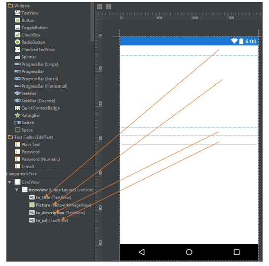
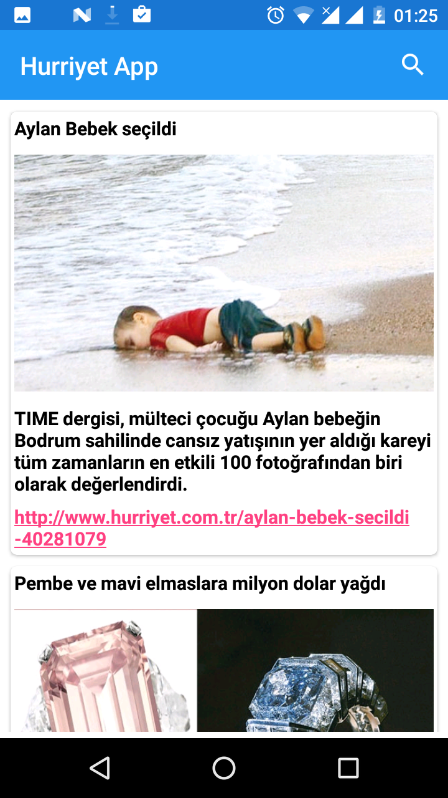

# HÜRRİYET APİ İLE HABER UYGULAMASI ÖRNEĞİ

##Açıklama:
Bu uygulama örnek olarak android ortaminda hurriyet api’lerine baglanarak kullanicin girdigi konudaki haberleri arayan ve bu haberleri bir listede tek tek gosteren bir uygulamadır. Kullanici ilk ekranda normal haberleri görür eğer isterse aramak istedigi kelimeyi actionbar' a yazar ( gundem / spor v.b. ) , mobil app sayfada hurriyet uzerindeki bu kelime ile ilgili aramayi gerceklestirir. Haberler  10 tane parti olarak gelmekte, kullanici en alttaki habere geldiginde bir istek daha yaparak, sonraki 10 haberin gelmesi saglanmaktadır. Eger kelime ile ilgili bir haber yoksa veya son sayfaya gelinmisse, kullaniciya bir toast ile mesaj gosterimektedir.

##Uygulama Basamakları:
1.	Uygulamada hürriyet api lerini kullanarak haber sorgulama gerçekleştirdik. Gerçekleştirdiğimiz bu sorgulama sonucu ilk 10 haber paketi listelenir eğer kullanıcı en son habere geldikten sonra, bir sonraki 10 luk haber paketi daha yüklenir. Haberler gösterim şekli yukardan aşağıya Haber başlığı, haber görseli, haber açıklaması ve haber linki şeklindedir.

[]

Recycler view ‘de verileri göstermek ve haberleri 10’ar parti halinde yüklemek için bir DataAdapter adında class oluşturduk.
2.	Actionbar’a  Search view şeklinde bir haber arama kısmı koyduk. Kullanıcı istediği haber kategorisini girerek buradan haberleri listeleyebilir. Araması gereken haber kategorilerini de baş harfini girdikten sonra Arraylist’ten çekerek autocomplate yapmakta.Searcview ‘i (https://github.com/MiguelCatalan/MaterialSearchView ) kütüphane şeklinde kullandım.
		Aranan haber kategorisi yoksa kullanıcıya “ Aradığınız kelimede haber bulunamadı “ şeklinde toast mesajı gösterilir.
		
  []
  
  []
  
  
3.	Bunun dışında başka bir kütüphane olarak Volley Request kullandık.Hurriyet api ile gelen json veriyi parse etmek  için.

Uygulamayla ilgili kısa anlatım videosu:  (https://youtu.be/5z1fxTx6RvI )

##KAYNAKLAR:
https://github.com/Muratoter/HurriyetApi

https://github.com/MiguelCatalan/MaterialSearchView

https://github.com/pwittchen/InfiniteScroll

http://benjii.me/2010/08/endless-scrolling-listview-in-android/

